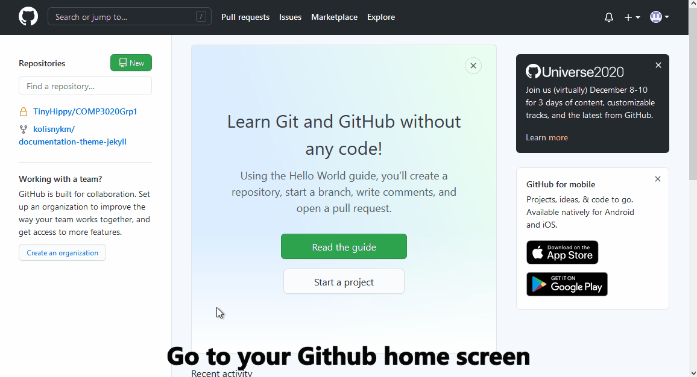

# Etter's _MODERN TECHNICAL WRITING_ Principles Applied to Posting Resumes on GitHub Pages.

For computer science students and other beginner technical writers wanting a small introduction to  [GitHub](https://github.com) and a look at how Etter's principles apply to the process of hosting your resume on [GitHub Pages](https://pages.github.com/).

## Topics
1. [Overview](#overview).
2. [Prerequisites](#prerequisites).
3. [Instructions](#instructions).    
    1. [Create a distributed version control repository](#create-distributed-version-control-repository).
    2. [Add lightweight markup resume](#add-lightweight-markup-resume).
    3. [Make static website](#make-static-website).
    4. [Quick gif guide](#quick-gif-guide)
4. [More Resources](#more-resources)
5. [Acknowledgments](#acknowledgments)
6. [FAQ](#faq)

## Overview
We will be applying three principles form Andrew Etter's book [_MODERN TECHNICAL WRITING_](https://www.amazon.ca/Modern-Technical-Writing-Introduction-Documentation-ebook/dp/B01A2QL9SS) to the resume process, namely:

1. **Use distributed version control** - Distributed version control is used by developers because it allows for multiple people to concurrently work on the same file, online or offline, while keeping track of all the changes made.
This may seem like overkill for a resume but it allows you to have several versions ready to go that can quickly edited and posted depending on your current needs. But more importantly, using distributed version control demonstrates to developers that you know the tools of the trade.  
We will be using [GitHub](https://github.com/) for our distributed version control.

2. **Use lightweight markup** - Formatting with lightweight markup allows you to format your document inline with the text, making it easily readable by anyone but also easily translated into xml for building websites.  
We will be using [Markdown](https://www.markdownguide.org/) as our lightweight markup to format our resume.

3. **Make static websites** - Static websites are excellent for documentation, they are fast, secure, portable, easy to translate to other document formats, and easy to test on any computer because they need few resources and have no dependencies on databases or other programs like JavaScript.  
We will be hosting our resume on [GitHub Pages](https://pages.github.com/) which will freely host one site per member and has excellent integration of the static site generating software [Jekyll](https://jekyllrb.com/).

## Prerequisites
The instructions below assume you already have a GitHub account and a current resume.

If you do not currently have a GitHub account go to [GitHub](https://github.com) and signup for a free account.

## Instructions

### Create distributed version control repository
You will need a new repository to house your resume on GitHub pages. We will be using GitHub because it offers distributed version control, it is open source, and it is widely used.

**To create a new repository on GitHub that is GitHub pages ready:**
1. Go to your GitHub home screen.
2. Click the **New** button
3. Name the repository _yourUsername_.github.io.  **Warning:** naming the repository anything other than _yourUsername_.github.io will not create a repository compatible with GitHub Pages.
4. Make sure the **Public** radio button is selected.
5. Initialize the repository with a README file by checking the **Add a README file** checkbox.
6. Click **Create repository** button.

You should now be in your new repository.

### Add lightweight markup resume
We will be using [Markdown](https://www.markdownguide.org/) as our lightweight markup. Markdown is easy to learn and the base syntax allows for compatibility across a broad range of platforms but lacks some useful features like tables and code blocks. Since we are using GitHub I would recommend using [GitHub flavored markdown](https://github.github.com/gfm/) as it offers more features and is fully compatible with GitHub Pages and Jekyll.

Editing tools are available on the GitHub site so all edits can be done there but I would recommend using [Atom](https://atom.io/) to edit documents for its side preview window, live server on localhost, IDE terminal, and most importantly, full GitHub integration.

**To add your resume to the repository:**
1. Click the **Add file** button within your new repository.
2. Name the new file index.md.
2. Populate index.md with your resume formatted in Markdown.
3. Scroll down and click the **Commit new file** button.

### Make static website
[Jekyll](https://jekyllrb.com/) will build the static website for hosting on [GitHub Pages](https://pages.github.com). We will be using one of the default Jekyll templates to provide our website layouts and styles. You can edit existing templates and create your own.

**To generate your static website:**
1. Go to your GitHub repository
2. Select the **Settings** tab.
3. Scroll down to the **GitHub Pages** section.
4. Click the **Choose a theme** button.
5. Find a theme you like and click the **Select theme** button.

Once the theme is selected you will find a new file in your repository named **_config.yml** this file holds the website front matter, or settings for the overall template, and can be edited to suit your needs.

Your website is now hosted on GitHub Pages at https://_yourUsername_.github.io.

### Quick gif guide
Bellow is a quick gif guide taking you through all the steps listed above.

## More Resources
* [_MODERN TECHNICAL WRITING_](https://www.amazon.ca/Modern-Technical-Writing-Introduction-Documentation-ebook/dp/B01A2QL9SS) a book by Andrew Etter.
* Interactive [Markdown tutorial](https://www.markdowntutorial.com/) on basic syntax.
* [Mastering markdown](https://guides.github.com/features/mastering-markdown/) tutorial that includes GitHub flavored markdown.
* Mike Dane's [Jekyll Course](https://www.mikedane.com/static-site-generators/jekyll) guides you through all the Jekyll basics from installation to website deployment.
* My favorite text editor [Atom](https://atom.io/), sorry [Notepad++](https://notepad-plus-plus.org/) your time is over.

## Authors & Acknowledgments
This project was created for [University of Manitoba's](https://umanitoba.ca) COMP-3040-A01 fall 2020: _Technical Communication in Computer Science_ by Michael Kolisnyk.

I would like to thanks all the members of Fantastic Five for their workshopping and peer editing on this project and Billie Thompson for providing [a good readme template](https://github.com/PurpleBooth/a-good-readme-template).

## FAQ
**I followed the steps but there is nothing at myUsername.github.io, why?**
While the updates to GitHub pages are usually fairly quick, it can take up to 20 minutes for updates to occur.

**I don't like the layout and style of any of the default themes, how do I edit these things with Jekyll?**
Using Jekyll software is outside the scope of this document, but Mike Dane's  [Jekyll Course](https://www.mikedane.com/static-site-generators/jekyll) offers easy to follow guides for working with Jekyll.
